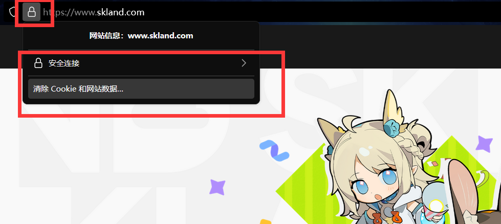
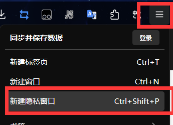

# Skyland-Auto-Sign

[明日方舟森空岛一键签到脚本，基于python](https://gitee.com/FancyCabbage/skyland-auto-sign#mode3)


## 一、使用 Github Action 自动运行脚本方法

> 部署———使用 Github Actions 托管

### 1.新建仓库

首先新建一个仓库（新建时的可选项不勾选，否则多出来的默认文件还得处理）

### 2.下载并上传源文件

将原仓库的源代码文件全部下载下来，上传到 github （ `.github` 及 `.build` 等文件夹不支持直接网页上传，建议保留原压缩包直接上传后通过命令行解压，详见文末可能遇到的问题一项）

### 3.获取凭据（二选一，两者返回的值都一样。温馨提示：请务必保证自身账号的安全。）

>登录 [森空岛网页版](https://www.skland.com/) 后，打开 https://web-api.skland.com/account/info/hg 记下 content 字段的值（即引号里的值）

>登录 [鹰角网络通行证](https://user.hypergryph.com/login) 后，打开 https://web-api.hypergryph.com/account/info/hg 记下 content 字段的值（同上）

### 4.添加 Cookie 至 Secrets

在仓库的项目主页上方的菜单中

`Settings` -> `Secrets and variables` -> `Actions` -> `New repository secret`

创建名为 `TOKEN` 的环境变量（注意变量名全大写），并填入上一步获取 content 的值，最后点击 `Add secret` （如果要管理多个账号，换行即可）

### 5.启动 Github Action

> Actions 默认为关闭状态，需要手动执行一次，若成功运行其才会激活。

返回项目主页面，点击上方的 `Actions` ，再点击左侧的 `auto_sign` ，再点击 `Run workflow`

（如果是第一次使用 GitHub Action 的话，在仓库上方菜单中进入 `Actions` 后，点击 `I understand... enable them`>`Enable workflow`）

至此，部署完毕，之后就可以自动运行签到了。


## 二、可能遇到的问题

- 仓库上方菜单中进入 `Actions` 后没有 `I understand... enable them` 选项或没有左侧的 `auto_sign` 选项

需要将压缩包的内容解压在项目根目录，最终仓库首页如图，GitHub Actions 默认从根目录开始运行。


在代码空间中的下方终端输入命令行，将其解压缩，然后将解压后的文件移动到根目录

- 原项目 `Run workflow` 运行错误

原项目在 `.github` 文件夹中的 `auto_sign.yaml` 文件里并没有调用 `requirements.txt`，而是写死了：

  ```json{
pip install requests
  ```

所以导致编译时忽略了 `requirements.txt` 里的 cryptography。

因此需要将 `auto_sign.yaml` 文件里的

  ```json{
- name: Install dependencies
run: |
python -m pip install --upgrade pip
pip install requests
  ```

修正为：

  ```json{
- name: Install dependencies
run: |
python -m pip install --upgrade pip
pip install -r requirements.txt
  ```

- 使用浏览器登录多个账号获得 TOKEN 时要注意的问题

**不要去登出账号，否则鹰角网络通行证会失效！**

如果要添加多个账号，请删除浏览器缓存。或者使用浏览器自带的隐私浏览模式，拿到 Token 后，关闭隐私窗口，再登录一次即可！



- 多端登录的问题

同一账号多端登录是没问题的，但是要注意一点就是电脑在用密码登录后，手机客户端有可能会被挤掉

最后就是别手贱去点客户端里的清理会话，因为那样子会把所有的登录状态清空


## 三、注意事项

**下方相关数据仅为估算，只可作参考用，对因此造成的任何可能的损失概不负责，具体标准请自行查阅！**

- 鹰角解除了方舟每日签到的风控，改为登岛检票的接口被风控，可喜可贺可喜可贺，所以如果仅需要方舟签到的请放心使用，倘若需要登岛检票签到的还请理解。

- 如果想直接使用本仓库，直接将仓库复制，然后按照 3 -> 4 -> 5 的顺序依次完成即可。

- Github Actions 会对 60 天没有活动的仓库自动禁用，可能要主动关注一下 github actions 的运行情况（一般会发邮件通知 actions 执行失败）

- Github Actions 产生的费用

  - 如果仓库是公开的（public）：
GitHub 会对公开仓库提供完全免费的 GitHub Actions 使用时间，不限分钟数（但有每月 50,000 次请求的软限制）。
  - 如果仓库是私有的（private）：
GitHub 只提供每月一定的免费分钟数（2,000 分钟，大概相当于 $16 折扣额度），超过就要按量付费（仅运行本项目的情况下大概 0.01$/天）。


## 四、README编写参考

[森空岛一键签到skyland-auto-sign](https://gitee.com/FancyCabbage/skyland-auto-sign#mode3)

[森空岛签到skland-daily-attendance](https://github.com/enpitsuLin/skland-daily-attendance/blob/main/README.md)

[文档-查看 GitHub Actions 使用情况](https://docs.github.com/zh/billing/managing-billing-for-your-products/managing-billing-for-github-actions/viewing-your-github-actions-usage)
